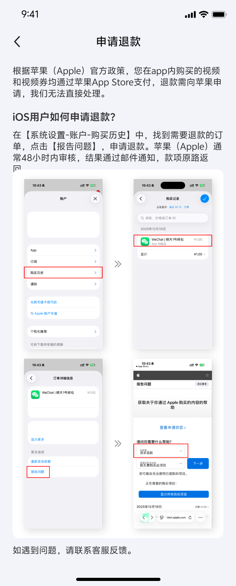

# 斯诺克大师 App 第二期需求文档

> 来源：斯诺克大师国内App v1.0.0产品需求文档(变更版).pdf
> 提取日期：2026-09-07（基于 2026-08-30 版本更新）
> 说明：结合 PRD 文字 + 交互图/UI截图提取，UI参考图为从 PRD 右侧栏提取的独立 UI 截图
> 变更说明：本文档已根据需求评审会议后的变更版PRD同步更新，变更点以 `🔄 变更` 标注

---

## 第二期需求总览

| 序号 | 模块 | PRD 章节 | 页面 | 优先级 | 适用范围 |
|------|------|----------|------|--------|----------|
| 1 | 支付模块（微信支付/IAP） | 第7节 | P21-24 | P1 | 仅国内App |
| 2 | 个人数据可视化展示 | 第6节 | P18-21 | P1 | 国内 |
| 3 | 微信、抖音分享 | 第8节 | P25-27 | P1 | 国内 |
| 4 | App消息推送 | 第9节（合并至遗留优化章节） | P28-29 | P1 | 仅国内App |
| 5 | 一期遗留优化及新增需求 | 第10节 | P29-30 | - | 国内 |

---

## 1. 支付模块（微信支付/IAP）— 仅国内App

### 1.1 核心目标
- 安卓端用户通过**微信支付**购买视频和视频券
- iOS端用户通过**苹果IAP**购买视频和视频券
- 商品逻辑、订单逻辑、退款逻辑与现有小程序保持一致
- **仅国内App支持，国外App不支持**

### 1.2 商品类型
1. **一次性付费解锁视频**（现金解锁）
2. **视频券**（套餐购买）

---

### 1.3 付费解锁视频

#### 入口
- 场视频 tab 下 **"解锁视频"** 按钮
- 视频类型：全部视频（包含精彩集锦、失误集锦、单杆视频、局视频）

#### 解锁流程
1. 点击解锁 → 底部弹出**解锁方式弹窗**
   - 弹窗显示：视频缩略图 + 价格标签 + **【现金解锁X元】** 按钮 + 视频券解锁选项

2. 点击 **【现金解锁X元】**

3. 判断用户平台：
   - **安卓用户** → 调起微信支付 → 支付成功绿色勾 → 解锁成功提示

   **安卓端购买流程 UI（场视频tab → 解锁弹窗 → 微信支付 → 操作完成）：**
   

   - **iOS用户** → 调起苹果IAP支付 → 苹果支付对话框 → 确认 → 成功

   **iOS端购买流程 UI（解锁弹窗 → 苹果IAP对话框 → 确认 → 成功）：**
   

#### 支付成功

🔄 **变更**：后端状态由【下载中】改为【待下载】，我的视频入口改到"制作中"页面

- 弹窗提示 **【解锁成功】**（复用已有样式）
- 后端更新视频状态为 **【待下载】**，通知工控机上传原视频切片
- 视频封面变为 **【待下载】** 状态
- **【我的视频-制作中】** 页面新增该视频，如有多个下载中视频，按**解锁时间倒序**排列

#### 支付失败

| 平台 | 错误场景 | 提示文案 |
|------|----------|----------|
| 安卓（微信支付） | 用户取消 | "支付已取消" |
| 安卓（微信支付） | 操作过快 | "操作过快，请稍候再试" |
| 安卓（微信支付） | 其他失败 | "支付失败" |
| iOS（IAP） | 用户取消 | "支付已取消" |
| iOS（IAP） | 其他失败 | "支付失败" |
| 通用 | 用户取消支付 | 关闭弹窗，停留在当前页，toast提示【支付已取消】 |

🔄 **变更**：新增待讨论项 — 用户在前端付款成功，但因通讯/网络原因后端状态未更新，按支付失败处理，需原路退款，后端状态在通讯/网络恢复后更新正确的订单状态，并确保不要重复退款等

---

### 1.4 视频定价规则（现有，无需修改）

🔄 **变更**：精彩集锦与失误集锦合并为同一组定价

| 视频类型 | 定价条件 | 价格 |
|----------|----------|------|
| **精彩集锦、失误集锦** | 杆数 ≤ 5 | 1元 |
| **精彩集锦、失误集锦** | 杆数 ≤ 15 | 3元 |
| **精彩集锦、失误集锦** | 杆数 > 15 | 5元 |
| **单杆视频** | 分数 < 40 | 3元 |
| **单杆视频** | 40~50 | 4元 |
| **单杆视频** | 50~60 | 5元 |
| **单杆视频** | 60~70 | 6元 |
| **单杆视频** | 70~80 | 7元 |
| **单杆视频** | 80~90 | 8元 |
| **单杆视频** | 90~100 | 9元 |
| **单杆视频** | 100~110 | 10元 |
| **单杆视频** | 110~120 | 12元 |
| **单杆视频** | 130~140 | 16元 |
| **单杆视频** | > 140 | 18元 |
| **局视频** | - | 10元 |

---

### 1.5 视频退款

🔄 **变更**：退款逻辑大幅调整 — 失败状态拆分为下载失败/制作失败；iOS退款时间窗口从48h改为72h；新增App本地制作视频独立退款规则

#### 触发条件
- **我方原因导致**（文件出错、本地制作出错且自动重试3次无效）
- 视频状态转为 **【下载失败】** 或 **【制作失败】**
- **比赛记录、我的视频** 两个页面中，视频卡片上显示失败状态，显示 **【退款】** 按钮

#### 安卓端退款流程
1. 用户点击【退款】按钮（现有逻辑）
   - 该条视频订单变为 **【申请退款】** 状态
   - 按钮刷新为 **【已申请退款】**，toast提示"已申请退款"
2. 用户发起退款时，后台**自动退款**（现有逻辑）
   - 该条视频订单变为 **【已退款状态】**，**原路退款**至用户账户
   - 按钮刷新为 **【已退款】**

**安卓端退款状态流转 UI（退款→已申请退款→已退款）：**

#### iOS端退款流程
1. 用户点击【退款】按钮 → 进入**退款方式介绍静态页面**
2. 用户**仅能从苹果官方渠道**发起退款申请
3. 我方根据视频状态返回**退款建议**：

**🔄 工控机制作的视频：**

| 条件 | 退款建议 |
|------|----------|
| 视频解锁后 72h 内 | 【不退款】 |
| 视频解锁后 72h 后 + 无视频url | 【退款】 |
| 视频解锁后 72h 后 + 有视频url | 【不退款】 |

**🔄 App本地制作的视频（新增）：**

| 条件 | 退款建议 |
|------|----------|
| 视频已下载失败 / 制作失败 | 【退款】 |
| 其余状态 | 【不退款】 |

4. **无论苹果官方退款与否，App前端仅显示退款指引**
5. 后台订单记录 - 退款状态刷新

**iOS端退款方式介绍静态页面：**

---

### 1.6 购买视频券

#### 入口

🔄 **变更**：入口描述从"我的页面"改为"我的 → 视频券购买banner"

- **我的** → **视频券购买banner** → 视频券落地页 → **【购买】** 按钮

#### 视频券落地页UI
- 红色主题背景，标题"精彩不断 优惠不停"
- 三档套餐纵向排列，每档右侧有红色【立即购买】按钮

**视频券套餐页面 UI（红底三档套餐 + 支付流程 + 购买成功）：**

| 套餐 | 价格 | 券数量 | 有效期 |
|------|------|--------|--------|
| 基础套餐 | ¥9.9 | 3张 | 1个月 |
| 中级套餐 | ¥29.9 | 12张 | 3个月 |
| 高级套餐 | ¥118.8 | 60张 | 12个月 |

#### 支付流程
- 点击购买后，判断用户平台：
  - **iOS用户** → 调起苹果支付
  - **安卓用户** → 调起微信支付

#### 支付成功

🔄 **变更**：新增比赛记录页面底部视频券数量更新

- 前端系统 toast 提示 **【购买完成】**
- 用户账号下视频券数量**刷新**
- **【我的卡券】** 新增券的记录
- **比赛记录页面底部视频券数量更新**

**我的卡券页面 UI（My Coupons，橙色Bundle卡 + Reward Coupon卡）：**

- Bundle 卡：Can be used to unlock 3 wonderful video，含有效期
- Reward Coupon 卡：Can be used to unlock 1 wonderful video，含有效期

#### 支付失败

| 平台 | 错误场景 | 提示文案 |
|------|----------|----------|
| 安卓（微信支付） | 用户取消 | "支付已取消" |
| 安卓（微信支付） | 操作过快 | "操作过快，请稍候再试" |
| 安卓（微信支付） | 其他失败 | "支付失败" |
| iOS（IAP） | 用户取消 | "支付已取消" |
| iOS（IAP） | 其他失败 | "支付失败" |
| 通用 | 用户取消支付 | 关闭弹窗，停留在当前页，toast提示【支付已取消】 |

---

### 1.7 视频券退款
- **安卓端**：不支持用户发起视频券退款
- **iOS端**：用户可从苹果官方渠道发起退款申请，我方返回的退款建议均为 **【不退款】**

---

### 1.8 后台状态变更

🔄 **变更**：描述用词"记录"→"状态"；套餐明细新增【购买平台】【退款状态】字段更新要求

#### 付费明细
- App端视频购买及退款的**状态**，同步至后台**付费明细列表**，列表字段均正确更新
- **【购买渠道】** 字段：**新增【App】**
- **【购买渠道】** 筛选项：**新增【App】**

**后台付费明细表 UI（含退款状态列，红色箭头标注）：**

#### 套餐明细
- App端视频券套餐购买及退款的**状态**，同步至后台**套餐明细列表**，列表字段均正确更新
- 【购买渠道】字段，新增 **【App】** 类型
- 【购买渠道】筛选项，新增 **【App】** 类型
- **【购买平台】、【退款状态】** 字段需正确更新

**后台套餐明细表 UI（含购买渠道下拉筛选：小程序/H5/App）：**

---

## 2. 个人数据可视化展示（第二期）

### 2.1 核心目标
实现个人数据可视化展示，强化用户对记录个人资产、记录球技成长的平台属性的认知

### 2.2 首页个人卡片新增数据

🔄 **变更**："我的视频"数量定义大幅扩展；新增new角标逻辑；去除原首页提示条

首页顶部 - 个人卡片，新增四项数据：

**个人卡片 UI（头像 + 评级30 + 四项数据）：**

| 数据项 | 说明 | 交互 |
|--------|------|------|
| **总场数** | 该用户历史总场数（如图显示"32"） | 仅展示，不可点击 |
| **活跃天数** | 该用户历史总活跃天数（如图显示"234"） | 仅展示，不可点击 |
| **单杆最高** | 该用户历史单杆最高分（如图显示"82"） | 点击进入我的单杆分页面 |
| **我的视频** | 🔄 该用户账号下已解锁视频数量（**包括App、工控机制作的，腾讯云有链接的视频数；腾讯云已删除的不计入**），不包含下载中、制作中视频 | 点击进入我的视频页面 |

#### 🔄 新增：我的视频 new 角标逻辑
- 有新的制作完成视频时，【我的视频】角标提示数量
- **角标数量** = 已制作完成、未查看的视频数量
- 每点击播放一个 new 视频，角标数量 **-1**
- **原首页新视频未查看的提示条去除**
- **我的视频页面增加 new 标志**

> ⏳ 待确认："我的视频"数量是"已解锁视频数量"还是"本地视频数量"？

---

### 2.3 个人数据页面优化

#### 入口变更

🔄 **变更**：点击自己头像从"取消跳转"改为"无效"；他人头像去向更明确

- **原逻辑**：点击我的头像、他人的头像，均进入个人数据页面
- **修改为**：
  - 点击**他人**的头像 → 仍进入**个人数据**页面
  - 点击**我的**头像 → **无效**
  - 首页新增 **【我的数据】tab**（与"交手记录"tab并列）

**原个人数据页 UI（旧版 Statistics 页面，英文）：**

#### 新版页面布局（从上到下）

**新版个人数据页完整 UI（评级雷达图 + 进球率折线图 + 成功率进度条 + 单杆高分）：**

**① 顶部个人卡片**（同首页个人卡片）
- 头像 + 姓名（王小明）+ 评级标签（评级 30，蓝色）+ 二维码图标
- 四项数据：32 总场数 / 234 活跃天数 / 82 单杆最高 / 86 我的视频
- 下方：已登录计分系统 + 俱乐部名称 + 分享图标

**② Tab切换栏**
- 【交手记录】| 【我的数据】（默认选中"我的数据"）

🔄 **新增**：交手记录/我的数据切换时，下方时间筛选项**不重置**

**③ 时间筛选器**
- 【本周】【本月】【近三月】【自定义】四个按钮，选中态蓝色高亮
- 选中时间后，下方数据刷新

🔄 **变更**："近三月"标注为**待确认**

**④ 基础数据行**

🔄 **变更**：从"根据时间筛选变化"改为更明确的计算说明

- 总局数、总场数、交手人数、场胜率、局胜率、平均出杆时长
- **计算所选时间内，平均每局的数据**（现有逻辑）

**⑤ 当前评级卡片**（蓝色背景卡片）

🔄 **变更**：标题从"我的评级卡片"改为"当前评级卡片"；新增"称号"展示

- 数据**不跟随**时间筛选变化
- 显示用户当前评级、**称号**及能力图谱（五维雷达图：进攻/防守/心态/长台/围球）
- 如无评级，展示空状态
- 点击卡片**任意位置**进入【我的评级页面】

**⑥ 胜率/时长行**
- 场胜率 / 局胜率 / 平均出杆时长（三个指标横排展示）

**⑦ 进球成功率卡片**
- 大字显示进球成功率百分比（如"62%"）
- 下方折线图（横轴随筛选时间变化）

🔄 **变更**：新增平均与最佳数据分别展示

- **计算逻辑**：

| 指标 | 说明 | 备注 |
|------|------|------|
| 进球率 | 所选时间内每局进球率的平均值 | 仅保留整数部分（现有逻辑） |
| **走位成功率** | 筛选时间内，用户平均每局走位成功率的平均值 | **新增**支持根据时间范围计算 |
| **架杆成功率** | 筛选时间内，用户平均每局架杆成功率的平均值 | **新增**支持根据时间范围计算 |

🔄 **新增**：以下数据分别显示**平均与最佳**数据（红球/彩球/长台/走位/架杆成功率），绘制进度条

🔄 **新增**：所有数据**仅保留整数部分**（小数大于5也舍弃）

- **折线图交互**：
  - 根据所选时间，以折线图形式展示进球成功率数据随时间变化
  - 横轴单位随筛选时间变化：

| 筛选时间范围 | 横轴单位 | 显示格式 | 计算方式 | 一屏显示 |
|-------------|---------|---------|---------|---------|
| 本周 | 天 | 6/8 | 对应自然天内平均每局进球率 | 固定7天 |
| 1周 < 时间 ≤ 3个月 | 周 | 6/20~6/26 | 对应自然周内平均每局进球率 | 4周，超出左滑 |
| 3个月 < 时间 ≤ 12个月 | 月 | 6月、7月… | 对应自然月内平均每局进球率 | 固定4个月，超出左滑 |

- **折线图规则**：

🔄 **变更**：折线图规则大幅细化

  - 一页最多显示 **6个数据点**，超出6个点时左右横滑查看
  - 如中间某一节点无数据，**不显示数据点**，但显示横轴节点，前后两个数据点相连
  - 如筛选时间范围内仅开头或结尾有一个数据，横轴显示对应时间及前一时间、后一时间
  - **仅展示，点击无跳转**

**⑧ 各类成功率进度条**

🔄 **变更**：新增平均与最佳分别展示

- 红球成功率 / 彩球成功率 / 长台成功率 / 走位成功率 / 架杆成功率
- 每项**分别显示平均与最佳数据**，绘制进度条

**⑨ 稳定性区域**
- 平均偏差次数（红色图标）
- 平均得分（橙色图标）
- 数据来源于工控机端上报，计算所选时间内每局数据的平均值

**⑩ 单杆高分卡片**（蓝色背景卡片）
- **跟随时间筛选**，取值范围不同
- 最左侧显示所选时间内的**单杆最高分**（如图中显示"82"）
- 右侧分栏呈现：

| 分栏 | 含义 | UI截图中的数量 |
|------|------|---------------|
| 单杆20+ | 20~29分的单杆分数量 | 45 |
| 单杆30+ | 30~39分的单杆分数量 | 23 |
| 单杆40+ | 40~49分的单杆分数量 | 24 |
| 单杆50+ | 50~79分的单杆分数量 | 2 |
| 单杆80+ | 80~99分的单杆分数量 | 1 |
| 单杆100+ | ≥100分的单杆分数量 | 0 |

- 仅记录 **>20** 的单杆分
- 无数据时，展示 **"-"**

#### 通用规则

🔄 **变更**：UI颜色区分改为"不做"；查询速度从1s改为3s

- ~~UI：以不同的颜色区分不同的进球率、评级、单杆分~~ → **（不做）**
- 本页所有数据在无数据时，均显示 **"-"**
- 卡片、页面空状态均以UI图为准
- **查询速度要求**：页面**加载+数据查询**时间 < **3s**

#### 待确认项
- 🔄 是否可以只查看近**三年**的数据？（小程序？？）（原为"近一年"）

---

## 3. 微信、抖音分享（第二期）

> 抖音开发文档：发布内容至抖音 _ 移动/网站应用 _ 抖音开放平台
> 微信开发文档：API / 多端框架新增 API / 分享图片到微信
> **第一期需求仅实现保存视频至相册**

### 3.1 成品视频文件分享

#### 分享入口
- 视频播放器内（横屏播放器右侧分享按钮）
- 我的视频页视频卡片右上角分享图标

#### 分享弹窗UI

**成品视频分享弹窗 UI：**

#### 分享途径

🔄 **变更**：新增"微信分享"途径（保存至相册后跳转微信）；新增分享失败处理；弹窗改为toast

| 途径 | 实现方式 | 交互说明 |
|------|----------|----------|
| **🔄 微信分享** | 🔄 保存至相册后跳转微信 | 🔄 toast提示"视频已保存至相册，可前往微信发送给好友"，跳转微信 |
| **微信朋友圈** | 调用微信SDK | 跳转至动态编辑页面 |
| **抖音** | 调用抖音SDK | 跳转至作品编辑页面 → 发布后弹窗提示"已发布" → 可选回到斯诺克大师或留在抖音 |
| **保存至相册** | 系统API | 根据用户相册权限状态判断 |

🔄 **新增**：分享失败时 toast 提示 "分享失败，请重试"

#### 保存至相册权限处理
- **用户拒绝** → 弹窗提示 "无相册权限，请至设置中开启"（复用已有弹窗）
- **用户同意** → 保存后 **toast提示** "已保存至相册"（🔄 明确为toast）

---

### 3.2 个人数据页长图分享

#### 分享入口
- 我的数据 页面 **【分享】** 按钮

#### 分享弹窗UI

**个人数据页长图分享 UI（3个选项：微信/微信朋友圈/保存到相册，无抖音）：**

- 背景为半透明蒙层 + 个人数据页长图缩略
- 底部弹出分享选项：
  1. **微信**（绿色图标）
  2. **微信朋友圈**（绿色图标）
  3. **保存到相册**（灰色图标）
- **注意：个人数据页分享没有抖音选项**（与成品视频分享不同）

#### 分享途径

| 途径 | 实现方式 | 交互说明 |
|------|----------|----------|
| **微信好友/朋友圈** | 调用微信SDK，选择目标场景 | 🔄 分享后 **toast提示**"已分享"（原为弹窗），可选回到斯诺克大师或留在微信 |
| **保存至相册** | 系统API | 🔄 同视频保存逻辑（权限判断一致），**toast提示**"已保存至相册" |

---

### 3.3 分享埋点
- video_share 事件：
  - channel 字段：1=微信好友，2=朋友圈，3=抖音，4=相册
  - video_type、video_id

---

## 4. App消息推送（第二期）

> 接入极光推送跑通消息推送流程
> **仅国内App支持，国外App不支持**
> 极光推送文档：极光推送 _ 产品概述 / 推送 API

### 4.1 接入厂商

🔄 **变更**：明确二期需接通的具体厂商

- 全部厂商：华为、小米、OPPO、vivo、iOS
- **二期需接通：iOS、华为、OPPO**

### 4.2 系统权限

| 场景 | 说明 |
|------|------|
| 请求时机 | 在用户**首次安装app并打开**时，问询是否允许app通知 |
| 通知时机 | 事件发生，且**用户App不在前台**时，进行消息推送 |

**通知权限请求弹窗 UI（"允许发送通知？" 拒绝/始终允许）：**

### 4.3 通知事件

#### 4.3.1 比赛结果通知

🔄 **变更**：触发条件从"比赛结束时"改为"比赛场数据上传时"

- **触发**：比赛**场数据上传时**，通知用户
- **标题**：比赛结果通知
- **内容**：比赛结束，点击查看详情
- **点击跳转**：场详情页 → 视频回放 tab

**系统通知栏样式 UI（"比赛结果通知"通知条目）：**

#### 4.3.2 视频制作结果通知

🔄 **变更**：明确制作时机来源包括"工控机"和"APP本地"；制作失败跳转目标从"失效视频"改为"制作失败"

**制作成功**：
- **时机**：🔄 **工控机、APP本地** 的视频制作成功时
- **标题**：视频制作成功
- **内容**（按视频类型）：
  1. 单杆XX分视频已制作完成，点击查看详情
  2. 精彩集锦已制作完成，点击查看详情
  3. 失误集锦已制作完成，点击查看详情
  4. 局视频已制作完成，点击查看详情
- **点击跳转**：我的视频页面并打开视频，**横屏播放**

**制作失败**：
- **时机**：🔄 **工控机、APP本地** 的视频制作失败时
- **标题**：视频制作失败
- **内容**（按视频类型）：
  1. 单杆XX分视频制作失败，点击查看详情
  2. 精彩集锦制作失败，点击查看详情
  3. 失误集锦制作失败，点击查看详情
  4. 局视频制作失败，点击查看详情
- **点击跳转**：我的视频 → 🔄 **制作失败**页面（原为"失效视频"页面）

---

## 5. 一期遗留优化需求及新增需求

🔄 **变更**：此章节为变更版PRD全新增加

### 5.1 优化项

| 编号 | 内容 | 状态 |
|------|------|------|
| 1 | 每次重装app/换手机/本地视频缓存被清除，视频卡片状态改为"本地文件被删除"（而非制作中断状态） | 待开发 |
| 2 | app制作视频的视频清晰度待讨论优化方案 | ⏳ 待讨论 |
| 3 | app制作的视频俱乐部名称模糊，需优化显示 | ⏳ 待优化 |
| 4 | 页面字体大小自适应优化：部分页面字号本身较小需调整；app全局需做自适应，部分自适应有问题的样式使用固定字号 | 待开发 |
| 5 | 无头像、用户名的用户，由后端赋默认头像图，APP扫计分系统二维码后，计分系统端显示app默认头像 | 待开发 |
| 6 | 排行榜头像加载慢/长时间加载后失败 | ⏳ 待验证 |
| 7 | 华为安装包压缩：仅能上传兼容32位、64位的安装包，目前360MB+，需压缩 | ⏳ 待处理 |
| 8 | 视频崩溃问题 | ⏳ 待排查 |

### 5.2 新增需求

| 编号 | 内容 | 说明 |
|------|------|------|
| 1 | 工控机制作的视频支持倍速 | 改成预览态 |
| 2 | 下载视频的体验优化 | 退出播放器仍有下载进度显示 |
| 3 | 在比赛记录、排行榜点击已注销用户头像 | 原进入空页面 → 改为点击弹 toast "该用户已注销" |
| 4 | 视频卡片不同状态底图替换 | 以UI图为准 |
| 5 | UI页面优化补充 | 详见UI设计稿 |

---

## 6. 相关埋点事件（第二期涉及）

> 来源：PRD 第八节 埋点
> 🔄 **变更**：标题从"埋点（第一期）"改为"埋点"，新增"标黄的为二期内容"说明

### 6.1 支付相关埋点
| 事件名 | 触发时机 | 上报属性 |
|--------|----------|----------|
| video_unlock_start | 解锁视频成功时上报（券/现金） | unlock_type: 0=活动券, 1=套餐券, 2=付费解锁; video_price: 付费金额; video_type: 1=单杆, 2=精彩集锦, 3=失误集锦, 4=局视频; video_id |
| video_unlock_success | 解锁成功、进入下载时上报 | unlock_type, video_type, video_id |
| origin_download_success / origin_download_fail | 原片下载成功/失败时上报 | video_type, video_id; 失败时增加 fail_reason: 1=网络异常, 2=云端文件丢失, 3=用户杀掉app |
| local_make_start/success/fail | 本地制作开始/成功/失败时上报 | video_type, video_id; device_info: 设备机型; make_duration: 制作时长; 失败时增加 fail_reason: 1=音频合成失败, 2=本地下载文件不存在, 3=用户杀掉app |

### 6.2 分享相关埋点
| 事件名 | 触发时机 | 上报属性 |
|--------|----------|----------|
| video_share | 分享动作完成，icon点击一次记录一次 | channel: 1=微信好友, 2=朋友圈, 3=抖音, 4=相册; video_type, video_id |

---

## 7. 非功能需求

### 7.1 机型适配

🔄 **变更**：安卓最低版本从10.0改为8.0；iOS最低版本从15改为14

| 平台 | 机型 | 最低版本 |
|------|------|----------|
| 安卓 | 华为(旧版鸿蒙HarmonyOS 4.3及以前)、小米、OPPO、vivo | **安卓 8.0** |
| iOS | iPhone(小屏幕)、iPhone Pro max(大屏幕) | **iOS 14**（iPhone11） |

### 7.2 性能要求
- 个人数据页面：页面**加载+数据查询**时间 < **3s**

---

## 8. UI截图文件清单

| 文件 | 内容说明 |
|------|----------|
| `p17_img00_1440x642.jpeg` | 安卓端购买流程（场视频tab → 解锁弹窗 → 微信支付 → 操作完成） |
| `p17_img01_1440x552.jpeg` | iOS端购买流程（解锁弹窗 → 苹果IAP对话框 → 确认 → 成功） |
| `p18_img00_1440x810.jpeg` | 安卓端退款状态流转（退款→已申请退款→已退款） |
| `p18_img01_1440x558.jpeg` | 视频券套餐页面（红底三档套餐 + 支付流程 + 购买成功） |
| `p19_img00_750x1624.png` | 我的卡券页面（My Coupons，橙色Bundle卡 + Reward Coupon卡） |
| `p19_img01_1440x694.jpeg` | 后台付费明细表（含购买渠道列及筛选） |
| `p19_img02_1440x694.jpeg` | 后台套餐明细表（含购买渠道下拉筛选：小程序/H5/App） |
| `image.png` | 后台付费明细表（含退款状态列，红色箭头标注） |
| `p21_img01_690x436.png` | 个人卡片UI（头像 + 评级30 + 四项数据） |
| `p22_img00_750x1624.png` | 原个人数据页（旧版 Statistics 页面，英文） |
| `p22_img01_375x1471.png` | 新版个人数据页完整布局（评级雷达图 + 进球率折线图 + 成功率进度条 + 单杆高分） |
| `p24_img00_750x1624.png` | 成品视频分享弹窗（4个圆形图标：微信/朋友圈/抖音/保存到相册） |
| `p24_img01_1440x665.jpeg` | 横屏播放器内分享（4个圆形图标悬浮在横屏画面上） |
| `p24_img02_750x1624.png` | 个人数据页长图分享（3个选项：微信/朋友圈/保存到相册，无抖音） |
| `p25_img00_750x1666.png` | 微信分享"已发送"弹窗（绿色勾 + 返回斯诺克大师/留在微信） |
| `p25_img01_1186x554.png` | 抖音分享-投稿流程（APP集成SDK → 抖音发布器 → 携带话题 → 返回APP） |
| `p26_img00_948x2108.jpeg` | 通知权限请求弹窗（"允许发送通知？"拒绝/始终允许） |
| `p26_img01_750x1666.png` | 系统通知栏样式（"比赛结果通知"通知条目） |
| `new_p24_img00_750x1860.png` | 🔄 iOS端退款方式介绍静态页面（变更版新增） |
