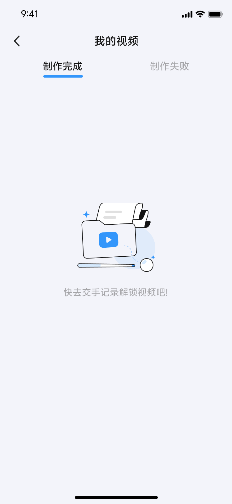

# 四、功能模块详解（第一期）

## 模块1：App架构与登录

本模块涵盖App的基础架构设计、用户登录、账号管理和数据同步等核心功能。

### 1.1 App架构设计

#### 1.1.1 双App架构

国内版和海外版分为两个独立App，两个包名，共用一套核心代码和业务逻辑。

**架构特点**:
- **独立包名**: 国内版和海外版使用不同的包名，作为两个独立应用发布
- **共用代码**: 核心业务逻辑、UI界面、功能模块共用一套代码
- **差异化配置**: 通过配置文件区分国内版和海外版的功能差异

**差异化配置项**:

| 配置项 | 国内版 | 海外版 |
|--------|--------|--------|
| 服务器地址 | 国内服务器 | 海外服务器 |
| 登录方式（iOS） | 微信 + Apple | Apple + Google + Facebook |
| 登录方式（安卓） | 微信 | Google + Facebook + Apple |
| 支付方式 | 微信支付（安卓）+ IAP（iOS） | 多种支付方式（第二期） |
| 语言支持 | 中文 + 英文 | 多语言 |
| 推送渠道 | 极光推送（华为/小米/OPPO/vivo） | 极光推送（FCM等） |

#### 1.1.2 服务器区域隔离

- **国内版**: 连接国内服务器，数据存储在国内
- **海外版**: 连接海外服务器，数据存储在海外

**数据隔离原因**:
- 满足数据合规要求
- 提升访问速度
- 降低跨境网络延迟

---

### 1.2 微信登录

微信登录是App的主要登录方式，通过微信UnionID机制实现小程序与App账号打通。

#### 1.2.1 UnionID机制

**技术原理**:
- 使用微信UnionID做用户标识
- 用户在小程序和App拥有相同的UnionID
- 后端通过UnionID关联用户身份，实现数据同步

**数据同步范围**:
- 比赛数据：历史比赛列表、比赛成绩、比赛详情
- 个人数据：用户昵称、头像、默认俱乐部设置
- 视频券数据：可用视频券列表、已过期&已使用视频券
- 视频数据：已解锁、制作中、已过期、制作失败的视频

#### 1.2.2 登录流程

**标准登录流程（9步）**:

```
1. 用户打开斯诺克大师App，进入登录页
   ↓
2. 点击"微信登录"按钮
   ↓
3. 系统调起微信App，展示授权页面
   ↓
4. 用户点击"确认登录"
   ↓
5. 微信返回授权code，App获取code
   ↓
6. App调用后端 /api/auth/wechat/login 接口，传递code
   ↓
7. 后端通过code + AppSecret调用微信接口换取access_token和unionid
   ↓
8. 后端根据unionid查询/创建用户，同步数据，生成App token
   ↓
9. 返回token给App，登录成功
```

**登录成功后的处理**:
- 生成App token，用于后续接口调用
- 同步小程序端数据到App
- 如果是新用户，自动创建账号并同步微信昵称、头像
- 如果是老用户，更新登录状态和token

#### 1.2.3 异常场景处理

| 序号 | 异常场景 | Toast提示 |
|------|----------|-----------|
| 1 | 用户未同意隐私协议时，点击【微信登录】或【苹果账号登录】 | "请先阅读并同意隐私政策与用户协议" |
| 2 | 用户未安装微信 | "请先下载微信App"，引导用户下载微信 |
| 3 | 用户无微信账号 | 微信内引导用户注册新账号 |
| 4 | 用户取消授权 | "已取消微信授权" |
| 5 | 授权过期/无效 | "授权已过期，请重试" |
| 6 | 网络异常 | "网络异常，请检查后重试" |
| 7 | 后端接口超时 | "加载超时，请稍后重试" |
| 8 | 微信SDK返回错误 | 对应的错误提示信息 |

#### 1.2.4 登录页UI

**iOS端登录页**:

<div align="center">
  
</div>

**安卓端登录页**:

<div align="center">
  
</div>

**登录页元素**:
- 微信登录按钮（绿色）
- 苹果账号登录按钮（仅iOS端显示）
- 隐私政策与用户协议勾选框
- 右上角关闭按钮（进入游客模式）

---

### 1.3 苹果账号登录（iOS端）

苹果账号登录是iOS端的可选登录方式，使用苹果账号进行授权登录。

#### 1.3.1 登录流程

```
1. 用户点击"通过Apple登录"按钮
   ↓
2. 系统调起苹果账号授权页面
   ↓
3. 用户通过Face ID/Touch ID/密码验证
   ↓
4. 苹果返回授权信息（user、email、identityToken等）
   ↓
5. App调用后端接口，传递授权信息
   ↓
6. 后端验证并查询/创建用户，生成token
   ↓
7. 返回token给App，登录成功
```

#### 1.3.2 新用户与老用户处理

**新用户（未注册过）**:
- 自动创建新账号
- 使用用户苹果账号的昵称与头像
- 如果是首次登录，昵称可能显示为"Apple用户"

**老用户（已注册过）**:
- 直接登录
- 保持原有的用户信息和数据

**注意**: 苹果账号登录不与小程序同步数据，仅App内数据。

---

### 1.4 游客模式

游客模式允许用户在不登录的情况下浏览App，但功能受限。

#### 1.4.1 进入方式

- 用户在登录页未登录，点击右上角关闭按钮
- 进入游客模式

#### 1.4.2 功能限制

**游客模式下的行为**:
- 所有页面显示空状态
- 可以浏览App界面，但无法查看具体数据
- 点击以下模块时，弹出登录页：
  - 首页
  - 交手记录
  - 我的视频
  - 个人中心
  - 其他需要登录的功能

**空状态展示**:

<div align="center">
  
  
  
</div>

#### 1.4.3 退出游客模式

- 游客模式下，登录页可再次点击关闭
- 点击需要登录的功能时，弹出登录页
- 登录成功后，退出游客模式，进入正常模式

---

### 1.5 账号注销

微信授权登录的账号支持注销功能，注销后数据将被永久删除。

#### 1.5.1 注销流程

```
1. 用户点击注销按钮
   ↓
2. 弹出确认注销弹窗
   - 提示文案："确认注销吗？您账号下的数据将被永久删除且不可恢复"
   ↓
3. 用户点击"确认"
   ↓
4. 弹窗关闭，弹出二次确认弹窗
   ↓
5. 用户点击"注销"
   ↓
6. 注销用户账户
   ↓
7. 回到游客模式，调起登录页面
```

**二次确认弹窗**:

<div align="center">
  
</div>

#### 1.5.2 注销后处理

**App端**:
- 用户账户被注销
- 所有数据被永久删除
- 回到游客模式
- 自动调起登录页面

**小程序端同步**:
- App端注销的微信账号，下次在小程序调用接口时
- 返回【该账号已注销】的Toast提示
- 刷新小程序为未登录状态

**注意**: 注销操作不可恢复，用户数据将被永久删除。

---

### 1.6 计分系统扫码登录

计分系统同时支持App扫码和微信扫码登录，实现App与计分系统的联动。

#### 1.6.1 扫码登录规则

**支持的方式**:
1. 国内计分系统登录二维码不做改造，同时支持国内App、微信扫码
2. 用户使用App或小程序登录、退出计分系统后，登录状态同步至App
3. 不支持其他应用扫计分系统二维码（现有逻辑）
4. 不支持App扫码其他二维码（现有逻辑）

**扫码流程**:

```
1. 用户在计分系统界面看到登录二维码
   ↓
2. 用户打开App，进入扫码功能
   ↓
3. App扫描计分系统二维码
   ↓
4. App发送登录请求到后端
   ↓
5. 后端验证并记录登录状态
   ↓
6. 计分系统显示登录成功
   ↓
7. 登录状态同步至App
```

#### 1.6.2 登录状态同步

- 用户使用App登录计分系统后，App端实时显示登录状态
- 用户使用小程序登录计分系统后，App端同步显示登录状态
- 用户退出计分系统后，App端同步显示退出状态

**登录状态展示**:

<div align="center">
  
  
</div>

**状态说明**:
- **在线状态**: 显示"在线"标识，可以看到交手记录和视频
- **未登录状态**: 显示"计分系统未登录"提示，引导用户扫码登录

---

*下一章: [模块2：视频本地制作](#模块2视频本地制作)*
