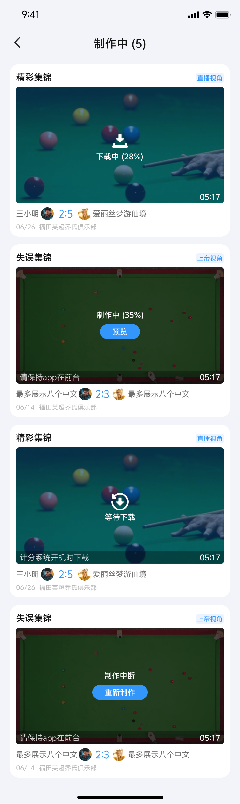
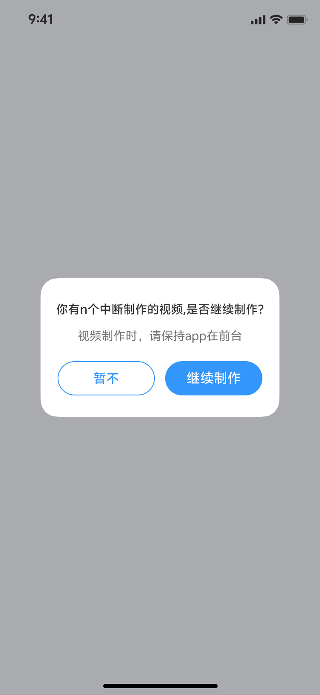
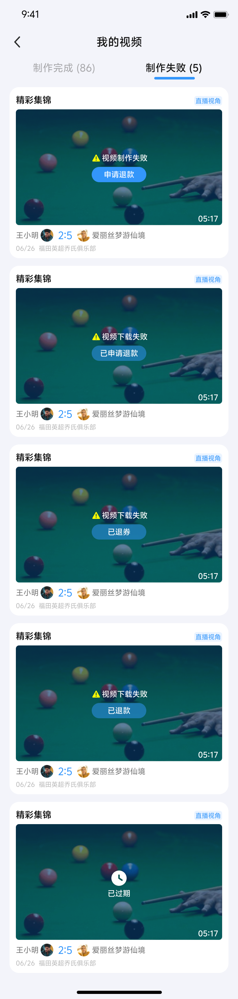

## 模块2：视频本地制作（核心模块）

视频本地制作是App的核心功能，将视频制作从工控机转移到用户手机本地，大幅提升制作速度和用户体验。

### 2.1 制作方式判断逻辑

#### 2.1.1 判断规则

用户点击"解锁视频"后，系统按以下规则判断制作方式：

```
┌─────────────────────────────────────┐
│   用户点击"解锁视频"                  │
└─────────────────────────────────────┘
              ↓
┌─────────────────────────────────────┐
│   检测当前设备是否满足本地制作条件      │
│   • iOS系统 ≥ iOS 15                │
│   • Android系统 ≥ 安卓10.0           │
│   • 手机剩余空间 ≥ 视频大小 + 200MB   │
│   • 其他硬件条件                      │
└─────────────────────────────────────┘
              ↓
        ┌─────┴─────┐
        ↓           ↓
   ┌────────┐  ┌────────┐
   │满足条件│  │不满足  │
   │        │  │条件    │
   └────────┘  └────────┘
        ↓           ↓
   App本地      工控机
   制作流程     制作流程
```

#### 2.1.2 设备最低要求

| 平台 | 最低系统版本 | 存储空间要求 |
|------|-------------|-------------|
| iOS | iOS 15 | 视频大小 + 200MB |
| Android | 安卓10.0 | 视频大小 + 200MB |

**存储空间检测时机**:
- 下载任务开始前：检测手机空间，不足时提示"手机可用存储空间不足"，不开始下载任务
- 下载过程中：检测手机空间，不足时提示"手机可用存储空间不足"，终止下载任务
- 制作开始前：检测手机空间，不足时提示，终止制作任务

**英文提示**: "Insufficient storage space on your device."

#### 2.1.3 工控机制作流程（降级方案）

当设备不满足本地制作条件时，自动切换为工控机制作流程：

**特点**:
- 视频制作由工控机完成
- App端无"下载中"、"本地制作中"状态
- 仅有原工控机的"制作中"状态
- 制作完成后，视频上传至腾讯云，App从腾讯云下载成品视频

**适用场景**:
- 低版本手机（iOS < 15 或 Android < 10.0）
- 手机存储空间不足
- 其他硬件条件不满足

---

### 2.2 视频状态机（9种状态）

视频制作过程中，视频会经历9种状态，每种状态对应不同的UI展示和业务逻辑。

#### 2.2.1 状态定义

| 状态值 | 状态名称 | 状态说明 | 小程序同步文案 | UI展示 |
|--------|----------|----------|----------------|--------|
| 0 | 待解锁 | 比赛结束后可解锁的视频 | 未明确 | 显示"待解锁"标识 |
| 1 | 已解锁等待上传 | 用户已解锁，等待工控机上传原片 | 制作中，请至App内查看 | 显示"等待下载"标识 |
| 2 | 原片已上传 | 工控机已将原片上传至腾讯云 | 未明确 | 过渡状态 |
| 3 | 下载中 | App正在从腾讯云下载原片 | 制作中，请至App内查看 | 显示下载进度条 |
| 4 | 下载失败 | 原片下载失败 | 制作失败，请至App内查看 | 显示"下载失败" |
| 5 | 本地制作中 | App正在进行视频制作 | 制作中，请至App内查看 | 显示制作进度条 |
| 6 | 制作失败 | 视频制作失败 | 制作失败，请至App内查看 | 显示"制作失败" |
| 7 | 制作完成 | 视频制作完成，可播放 | 制作成功，请至App内查看 | 显示视频封面，可播放 |
| 8 | 已过期 | 视频已过期 | 已过期 | 显示"已过期"标识 |

#### 2.2.2 状态流转图

```
┌─────────┐
│待解锁(0) │ ← 比赛结束，工控机生成视频列表
└────┬────┘
     │ 用户点击解锁
     ↓
┌─────────────────┐
│已解锁等待上传(1) │ ← 等待工控机裁切并上传原片
└────┬────────────┘
     │ 工控机上传完成
     ↓
┌──────────────┐
│原片已上传(2)  │ ← 原片已上传至腾讯云
└────┬─────────┘
     │ App开始下载
     ↓
┌─────────┐
│下载中(3) │ ← 从腾讯云下载原片到本地
└────┬────┘
     │
     ├─ 下载成功 → ┌──────────────┐
     │             │本地制作中(5)  │ ← App本地制作视频
     │             └────┬─────────┘
     │                  │
     │                  ├─ 制作成功 → ┌──────────────┐
     │                  │             │制作完成(7)    │ ← 视频制作完成
     │                  │             └──────────────┘
     │                  │
     │                  └─ 制作失败 → ┌──────────────┐
     │                                │制作失败(6)    │
     │                                └──────────────┘
     │
     └─ 下载失败 → ┌──────────────┐
                   │下载失败(4)    │
                   └──────────────┘

注：任何状态下，如满足过期条件，都会进入已过期(8)状态
```

#### 2.2.3 状态详解

**状态0：待解锁**
- 触发条件：比赛结束后，工控机生成该场比赛可解锁视频列表
- UI展示：视频卡片显示"待解锁"标识，显示解锁按钮
- 用户操作：点击"解锁视频"按钮，选择使用视频券或付费解锁

**状态1：已解锁等待上传**
- 触发条件：用户点击解锁视频成功
- 处理逻辑：
  - 指令通过服务器发送至工控机
  - 工控机在开机状态下，裁切原视频片段
  - 上传原片至腾讯云
  - 上传素材数据（比分、头像、时间戳等）
- UI展示：视频卡片显示"等待下载"标识
- 相册权限：解锁视频成功后，弹窗询问用户是否允许相册使用权限

**状态2：原片已上传**
- 触发条件：工控机已将视频片段上传至腾讯云
- 处理逻辑：过渡状态，App检测到原片已上传后开始下载
- UI展示：过渡状态，用户不可见

**状态3：下载中**
- 触发条件：App开始从腾讯云下载原片
- 处理逻辑：
  - 检测手机剩余空间（≥视频大小+200MB）
  - 从腾讯云下载原片
  - 下载视频信息（比分、头像等）
- UI展示：视频卡片显示下载进度条
- 并发限制：同时最大下载数2个

**状态4：下载失败**
- 触发条件：原片下载失败（网络异常/文件丢失/用户杀App）
- 处理逻辑：根据失败原因，自动退券或支持手动申请退款
- UI展示：视频卡片显示"下载失败"，显示"退款"按钮

**状态5：本地制作中**
- 触发条件：视频下载成功，开始本地制作
- 处理逻辑：
  - 视频压缩处理（720P）
  - 叠加片头片尾、俱乐部名称
  - 叠加用户头像、昵称、比分条
  - 叠加Logo和特效
- UI展示：视频卡片显示制作进度条
- 自动触发：用户进入首页/交手记录页/场详情页/我的视频页时自动开始

**状态6：制作失败**
- 触发条件：视频制作失败（素材丢失/空间不足/用户杀App）
- 处理逻辑：根据失败原因，自动退券或支持手动申请退款
- UI展示：视频卡片显示"制作失败"，显示"退款"按钮

**状态7：制作完成**
- 触发条件：视频制作成功
- 处理逻辑：
  - 视频保存到App本地缓存
  - 如授权相册，自动保存到相册
  - 视频卡片显示NEW标记（未播放前）
- UI展示：显示视频封面，可点击播放

**状态8：已过期**
- 触发条件：
  - 视频48h内未解锁
  - 原视频片段下载后90d内未制作
  - 视频在App本地缓存被清除
- 处理逻辑：视频标记为已过期，无法播放
- UI展示：视频卡片显示"已过期"标识

#### 2.2.4 视频状态UI展示

**待解锁状态**: 视频卡片显示"待解锁"标识，显示解锁按钮

**下载中状态**: 视频卡片显示下载进度条

**制作中状态**: 视频卡片显示制作进度条

**制作完成状态**: 显示视频封面，可点击播放

**已过期状态**: 视频卡片显示"已过期"标识，灰色遮罩

> 注：以上状态标识为小图标，实际UI展示请参考《测试用例》中的截图或Figma设计稿。

**完整UI界面参考**:

<div align="center">
  
</div>

---

### 2.3 下载与制作任务管理

#### 2.3.1 下载任务管理

**并发限制**:
- 同时最大下载数：2个
- 任务队列优先级：下载任务 > 制作任务

**下载流程**:
```
1. 检测手机剩余空间（≥视频大小+200MB）
   ↓
2. 空间不足 → 提示"手机可用存储空间不足"，不开始下载
   ↓
3. 空间充足 → 开始下载
   ↓
4. 从腾讯云下载原片
   ↓
5. 下载过程中持续检测空间
   ↓
6. 下载完成 → 更新状态为"原片已上传"
   ↓
7. 下载失败 → 更新状态为"下载失败"，触发异常处理
```

**下载任务队列**:
- 多个视频同时解锁时，按解锁时间顺序排队
- 同时最多下载2个视频
- 下载完成后，自动开始下一个任务

#### 2.3.2 制作任务管理

**自动制作触发**:

用户进入以下4个页面时，系统自动查询并触发制作：
1. **首页**
2. **交手记录页**
3. **场详情页**
4. **我的视频页**

**触发逻辑**:
```
1. 用户进入触发页面
   ↓
2. 系统查询是否有已下载完成的视频（状态=原片已上传）
   ↓
3. 如有 → 自动开始制作
   ↓
4. 更新状态为"本地制作中"
   ↓
5. 显示制作进度条
```

**制作任务队列**:
- 多个视频待制作时，按下载完成时间顺序排队
- 同时最多制作1个视频（受设备性能限制）
- 制作完成后，自动开始下一个任务

---

### 2.4 异常处理机制

#### 2.4.1 原片下载失败

**场景1: 用户网络异常或杀掉App**

处理逻辑：
- 网络恢复 + App在前台时，自动重试（静默）
- 弹出弹窗询问："你有X个制作中断的视频，是否继续制作？"

**制作中断弹窗**:

<div align="center">
  
</div>

> 弹窗内容："你有X个制作中断的视频，是否继续制作？"
> - 点击"继续制作"：跳转到我的视频-制作中页面
> - 点击"暂不"：弹窗关闭，视频显示为"制作中断状态"

**用户选择**:
- 点击"继续制作"：跳转到我的视频-制作中页面，自动重新开始下载
- 点击"暂不"：弹窗关闭，我的视频、比赛记录中的视频显示为【制作中断状态】

**场景2: 云端文件丢失**

处理逻辑：
- 视频显示为"下载失败"状态
- 自动退券至用户账户（返还有效期）
- 或显示下载失败，支持用户手动申请退款
- 视频状态同步至小程序，显示为【制作失败，请至App内查看】

#### 2.4.2 本地制作中断

**场景: 用户杀掉App或App未保持在前台**

处理逻辑：
- 用户下次启动App时，自动继续/重新制作
- 弹出弹窗提示："你有X个制作中断的视频，是否继续制作"

**用户选择**:
- 点击"查看"：跳转到我的视频-制作中页面，视频自动重新开始制作
- 点击"暂不"：弹窗关闭，我的视频、比赛记录中的视频显示为【制作中断状态】

**弹窗优先级**: 最高（在活动弹窗之前，关闭后活动弹窗出现）

#### 2.4.3 本地制作失败

**场景1: 素材、数据丢失**

处理逻辑：
- 视频显示为"制作失败"状态
- 自动退券至用户账户（返还有效期）
- 或显示制作失败，支持用户手动申请退款
- 视频状态同步至小程序，显示为【制作失败，请至App内查看】

**场景2: 手机空间不足**

处理逻辑：
- Toast提示："手机可用存储空间不足，视频制作已终止"
- 终止制作任务
- 英文提示："Insufficient storage space on your device."

#### 2.4.4 自动退券机制

**退券条件（系统原因）**:
- 腾讯云文件丢失
- 素材数据丢失
- 自动退券至用户账户，返还有效期

**不退券条件（用户原因）**:
- 用户断网
- 用户杀掉App
- 保留任务 + 弹窗恢复

**退券方式**:
- 自动退券：系统检测到文件丢失后，自动退券
- 手动退款：用户点击"退款"按钮，申请退款

**模拟自动退券方式**:
- 制作阶段：等下载完成后清除App缓存 → 重进App触发制作 → 素材丢失 → 自动退券
- 下载阶段：需开发配合（使用失效URL）

---

### 2.5 视频过期规则

#### 2.5.1 过期条件

以下3种情况，视频均显示为【已过期】状态：

| 序号 | 过期条件 | 说明 |
|------|----------|------|
| 1 | 视频48h内未解锁 | 比赛结束后48小时内未解锁视频 |
| 2 | 原视频片段下载后90d内未制作 | 下载完成后90天内未完成制作 |
| 3 | 视频在App本地缓存被清除 | 本地缓存被清除，且无法重新制作 |

**注意**:
- 第3种情况，小程序显示【制作成功】，但App显示【已过期】
- 过期后视频无法播放，无法重新制作

#### 2.5.2 过期处理

**过期后行为**:
- 视频卡片显示"已过期"标识
- 无法点击播放
- 无法重新制作
- 小程序端同步显示"已过期"

**过期视频展示**:

<div align="center">
  
</div>

> 注：过期视频在视频卡片上显示"已过期"标识（小图标），实际UI展示请参考完整界面截图。

---

### 2.6 视频缓存清除与重新制作

#### 2.6.1 可重新制作场景

**条件**: 腾讯云存储的源视频文件及bin文件未被删除

处理逻辑：
- 视频显示为【本地文件被删除】状态
- 点击按钮可重新制作
- 重新下载原片并制作

#### 2.6.2 不可重新制作场景

**条件**: 腾讯云存储的源视频文件及bin文件已被删除

处理逻辑：
- 视频标记为【已过期】状态
- 无法重新制作
- 无法播放

---

### 2.7 视频渲染规则

#### 2.7.1 单杆视频、局视频渲染内容

渲染元素：
1. **片头片尾**: 标准片头片尾动画
2. **俱乐部名称**: 显示比赛所在俱乐部名称
3. **用户头像**: 显示甲乙双方头像
4. **用户昵称**: 显示甲乙双方昵称
5. **实时比分条**: 显示比赛实时比分
6. **斯诺克大师Logo**: 显示产品Logo

**渲染要求**:
- 比分与画面严格对应
- 成品与原工控机成品效果一致
- 单杆视频的成品效果以UI图为准

**视频示例**:
- 单杆视频：https://1255586792.vod2.myqcloud.com/398c6e54vodcq1255586792/da0bfb6d5001834811400350247/xO5zNeoA9wYA.mp4
- 局视频：https://1255586792.vod2.myqcloud.com/398c6e54vodcq1255586792/6b3b90525001834811399487994/bXa4Y54qgT4A.mp4

#### 2.7.2 精彩&失误集锦渲染内容

渲染元素：
1. **片头片尾**: 标准片头片尾动画
2. **俱乐部名称**: 显示比赛所在俱乐部名称
3. **转场特效**: 精彩镜头之间的转场特效
4. **标题字样**: 【精彩集锦】或【失误集锦】字样
5. **斯诺克大师Logo**: 显示产品Logo
6. **厚薄度&杆速**: 每一杆的厚薄度和杆速数据

**渲染要求**:
- 比分与画面严格对应
- 成品与原工控机成品效果一致

**视频示例**:
- 精彩集锦：https://1255586792.vod2.myqcloud.com/398c6e54vodcq1255586792/66d39a5b5001834811405888042/T70bEZ09VkAA.mp4
- 失误集锦：https://1255586792.vod2.myqcloud.com/398c6e54vodcq1255586792/884027265001834808078844625/9Fao8Yi5CNcA.mp4

#### 2.7.3 视频制作要求

**基本要求**:
- 比分与画面严格对应
- 成品与原工控机成品效果一致
- 单杆视频的成品效果以UI图为准

**压缩要求**:
- 视频压缩处理，清晰度为720P
- 每分钟视频大小不超过XMB（待确认）

**制作耗时要求**:
- 视频时长30min：制作时长 < 5min
- 带比分条视频每分钟制作时间 ≤ Xmin（待确认）
- 不带比分条视频每分钟制作时间 ≤ Xmin（待确认）

---

*下一章: [模块3：我的视频模块](#模块3我的视频模块)*
