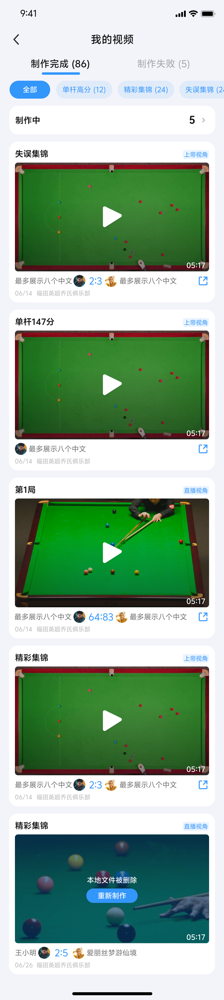
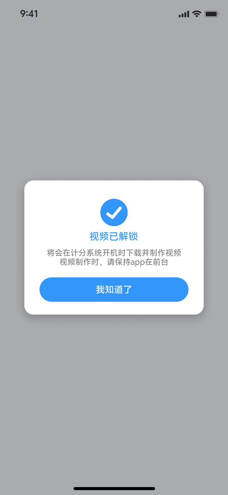

## 模块3：我的视频模块

我的视频模块是用户管理视频的核心页面，包含视频列表、分类筛选、制作中视频列表等功能。

### 3.1 页面结构

#### 3.1.1 页面布局

我的视频页面采用分层布局，从上到下依次为：

```
┌─────────────────────────────┐
│  顶部标题栏（固定）           │
├─────────────────────────────┤
│  Tab栏：有效视频 | 失效视频   │
├─────────────────────────────┤
│  分类筛选栏（固定）           │
│  全部 | 单杆高分 | 精彩集锦 | │
│  失误集锦 | 局视频            │
├─────────────────────────────┤
│  制作中视频横幅（可点击）      │
├─────────────────────────────┤
│                             │
│  视频列表区域（可滚动）       │
│                             │
│  [视频卡片1]                │
│  [视频卡片2]                │
│  [视频卡片3]                │
│  ...                        │
│                             │
└─────────────────────────────┘
```

#### 3.1.2 页面元素说明

**顶部标题栏**:
- 标题："我的视频"
- 固定显示，不随页面滚动

**Tab栏**:
- 两个Tab：有效视频 | 失效视频
- **有效视频**: 制作完成的视频（状态=7）
- **失效视频**: 制作失败的视频（状态=4/6）
- 默认选中"有效视频"Tab

**分类筛选栏**:
- 位于"有效视频"Tab下方
- 5个分类：全部 | 单杆高分 | 精彩集锦 | 失误集锦 | 局视频
- 分类名称后显示该类型已解锁视频的数量
- 仅计算已制作成功的视频，不包含制作中的视频
- 固定显示，不随页面滚动

**制作中视频横幅**:
- 显示制作中视频数量（包含下载中、制作中、下载中断、制作中断）
- 点击横幅进入制作中视频列表页
- 位于分类筛选栏下方

**视频列表区域**:
- 显示视频卡片列表
- 可上下滚动
- 视频卡片展示视频封面、状态、NEW标记等

#### 3.1.3 页面交互

**上划固定交互**:
- 页面向上滑动时，顶部标题栏、Tab栏、分类栏固定不动
- 仅视频列表区域滚动

**Tab切换**:
- 点击"有效视频"Tab：显示制作完成的视频
- 点击"失效视频"Tab：显示制作失败的视频

**分类筛选**:
- 点击分类名称：筛选对应类型的视频
- 点击"全部"：显示所有类型的视频
- 分类数量实时更新

**页面UI**:

<div align="center">
  
</div>

---

### 3.2 分类筛选逻辑

#### 3.2.1 分类类型

| 分类名称 | 说明 | 视频类型 |
|----------|------|----------|
| 全部 | 显示所有类型的视频 | 全部 |
| 单杆高分 | 单杆视频 | 单杆视频 |
| 精彩集锦 | 精彩镜头合集 | 精彩集锦 |
| 失误集锦 | 失误镜头合集 | 失误集锦 |
| 局视频 | 每局完整视频 | 局视频 |

#### 3.2.2 数量统计规则

**统计范围**:
- 仅计算已制作成功的视频（状态=7）
- 不包含制作中的视频（状态=1/3/5）
- 不包含制作失败的视频（状态=4/6）
- 不包含已过期的视频（状态=8）

**统计示例**:
```
用户视频列表：
- 单杆视频：5个（3个制作完成，2个制作中）
- 精彩集锦：3个（全部制作完成）
- 失误集锦：2个（1个制作完成，1个制作失败）
- 局视频：4个（全部制作完成）

分类筛选显示：
全部(12) | 单杆高分(3) | 精彩集锦(3) | 失误集锦(1) | 局视频(4)
```

#### 3.2.3 筛选交互

**点击分类**:
- 点击"全部"：显示所有已制作完成的视频
- 点击"单杆高分"：仅显示单杆视频
- 点击"精彩集锦"：仅显示精彩集锦
- 点击"失误集锦"：仅显示失误集锦
- 点击"局视频"：仅显示局视频

**分类切换**:
- 点击不同分类，视频列表实时更新
- 当前选中的分类高亮显示

---

### 3.3 制作中视频列表

#### 3.3.1 制作中横幅

**横幅位置**: 分类筛选栏下方

**横幅内容**:
- 文案："X个视频制作中"
- X = 下载中 + 制作中 + 下载中断 + 制作中断的视频数量
- 点击横幅进入制作中视频列表页

**横幅UI**:

<div align="center">
  
</div>

#### 3.3.2 制作中视频列表页

**页面入口**: 点击制作中横幅

**页面内容**:
- 显示所有制作中的视频
- 包含：下载中、制作中、下载中断、制作中断的视频

**视频状态展示**:

**下载中视频**:
- 显示下载中状态
- 显示下载进度条
- 可取消下载

<div align="center">
  
</div>

**制作中视频**:
- 显示制作中状态
- 显示制作进度条
- 可取消制作

<div align="center">
  
</div>

**下载中断/制作中断视频**:
- 显示中断状态
- 显示"继续"按钮
- 点击继续按钮恢复下载/制作

**预览功能**:
- 视频下载完成后，制作完成前，支持预览
- 点击预览，进入横屏使用简单播放器播放
- 简单播放器功能较简单，不支持球谱进度条、倍速等高级功能

#### 3.3.3 简单播放器 vs 专业播放器

| 功能 | 简单播放器 | 专业播放器 |
|------|-----------|-----------|
| 使用场景 | 下载完成后、制作完成前预览 | 制作完成后观看 |
| 播放控制 | 播放/暂停 | 播放/暂停 |
| 进度条 | 时间进度条 | 球谱进度条 + 时间进度条 |
| 倍速播放 | 不支持 | 支持（逐帧/0.25x/0.5x/1.0x/1.5x/2.0x） |
| 快捷操作 | 不支持 | 支持（连点/长按/滑动） |
| 亮度调节 | 不支持 | 支持 |
| 音量调节 | 不支持 | 支持 |
| 设置 | 不支持 | 支持 |
| 分享 | 不支持 | 支持（保存至相册） |

---

### 3.4 视频状态标识

#### 3.4.1 卡片状态展示

视频卡片根据视频状态显示不同的标识和UI。

| 状态 | 卡片标识 | 卡片UI | 可操作 |
|------|---------|--------|--------|
| 待解锁(0) | 显示"待解锁" | 显示解锁按钮 | 可点击解锁 |
| 下载中(3) | 显示下载进度条 | 显示下载进度 | 可查看进度 |
| 制作中(5) | 显示制作进度条 | 显示制作进度 | 可查看进度 |
| 已解锁(7) | 显示视频封面 | 显示NEW标记（未播放） | 可点击播放 |
| 制作失败(4/6) | 显示"制作失败" | 显示退款按钮 | 可申请退款 |
| 已过期(8) | 显示"已过期" | 灰色遮罩 | 不可操作 |

**状态UI示例**:

> 注：视频状态标识为小图标（28x28像素），实际UI展示请参考完整界面截图。
> 
> 各状态在视频卡片上的展示：
> - 待解锁：显示"待解锁"标识和解锁按钮
> - 下载中：显示下载进度条
> - 制作中：显示制作进度条
> - 已解锁：显示视频封面
> - 制作失败：显示"制作失败"和退款按钮
> - 已过期：显示"已过期"标识和灰色遮罩

<div align="center">
  
</div>

#### 3.4.2 NEW标记逻辑

**NEW标记规则**:
- App本地制作完成未播放的视频
- 在视频卡片**右上角**显示【new】标记（小写）
- 点击播放后，NEW标记消失

**NEW标记与红点的区别**:
- 原逻辑：工控机制作完成上传到腾讯云后未点击播放的视频，在视频卡片**右下角**显示红点
- 新逻辑：App本地制作完成未点击播放的视频，在视频卡片**右上角**显示【new】标记

**NEW标记UI**:

> 注：NEW标记为小图标，显示在视频卡片右上角。
> 
> NEW标记规则：
> - App本地制作完成未播放的视频
> - 在视频卡片**右上角**显示【new】标记（小写）
> - 点击播放后，NEW标记消失

<div align="center">
  
</div>

#### 3.4.3 标识优先级排列

当视频卡片有多个标识时，按以下优先级显示：

1. **有已解锁未查看的视频**（最高优先级）
   - 显示NEW标记
2. **有可解锁的视频**
   - 显示"待解锁"标识
3. **有制作中的视频**
   - 显示下载/制作进度条
4. **有已解锁已查看的视频**
   - 显示视频封面，无特殊标识
5. **视频已过期**（最低优先级）
   - 显示"已过期"标识

---

### 3.5 页面交互

#### 3.5.1 上划固定交互

**固定元素**:
- 顶部标题栏
- Tab栏（有效视频/失效视频）
- 分类筛选栏

**滚动元素**:
- 视频列表区域

**交互效果**:
- 页面向上滑动时，固定元素保持在顶部
- 视频列表区域可上下滚动
- 固定元素与滚动区域有视觉分隔

#### 3.5.2 空状态

**有效视频Tab空状态**:
- 显示空状态插画
- 文案："快去交手记录解锁视频吧"

**失效视频Tab空状态**:
- 显示空状态插画
- 文案："暂无失败视频"

**空状态UI**:

<div align="center">
  
</div>

#### 3.5.3 视频卡片点击

**有效视频Tab**:
- 点击视频卡片：进入专业播放器，横屏播放
- 点击分享按钮：弹出分享弹窗（保存至相册）

**失效视频Tab**:
- 点击视频卡片：显示视频详情
- 点击退款按钮：申请退款（仅系统原因失败时显示）

---

### 3.6 相册权限弹窗

#### 3.6.1 弹窗触发时机

**唯一触发时机**: 解锁视频成功后

**弹窗顺序**:
1. 先弹"视频已解锁"确认弹窗
2. 再弹"相册权限"弹窗

**注意**: 第一期仅在此时机弹窗询问相册权限

#### 3.6.2 权限处理

**弹窗内容**:
- 询问用户是否允许App访问相册
- 说明用途："用于保存制作完成的视频"

**用户选择**:

**允许**:
- 视频制作完成后，缓存至App本地
- 自动保存至用户相册
- 后续不再弹窗询问

**不允许**:
- 视频制作完成后，仅缓存至App本地
- 不自动保存至相册
- 用户可在视频卡片右上角手动保存

**相册权限弹窗UI**:

<div align="center">
  
</div>

> 弹窗顺序：先弹"视频已解锁"确认弹窗 → 再弹"相册权限"弹窗
> 第一期仅在此时机弹窗询问相册权限

#### 3.6.3 分享时的权限处理

在专业播放器内或我的视频页视频卡片右上角点击分享时：

**用户拒绝权限**:
- 弹窗提示："无相册权限，请至设置中开启"
- 复用已有弹窗样式

**用户同意权限**:
- 保存后提示："已保存至相册"

---

### 3.7 低版本手机适配

#### 3.7.1 工控机制作流程

**适用场景**: 低版本手机（不满足本地制作条件）

**特点**:
- 视频制作由工控机完成
- App端无"下载中"、"本地制作中"状态
- 仅有原工控机制作中状态

**状态展示**:
- 待解锁：显示"待解锁"标识
- 制作中：显示工控机制作中状态（无进度条）
- 制作完成：显示视频封面

**视频卡片**:
- 无下载进度条
- 无制作进度条
- 仅显示状态文字

#### 3.7.2 制作完成视频

**处理方式**:
- 工控机制作完成后，视频上传至腾讯云
- App从腾讯云下载成品视频
- 视频保存到App本地缓存
- 如授权相册，自动保存到相册

**播放方式**:
- 使用专业播放器播放
- 支持所有专业播放器功能

---

*下一章: [模块4：专业视频播放器](#模块4专业视频播放器)*
