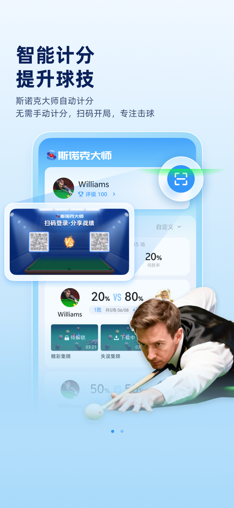
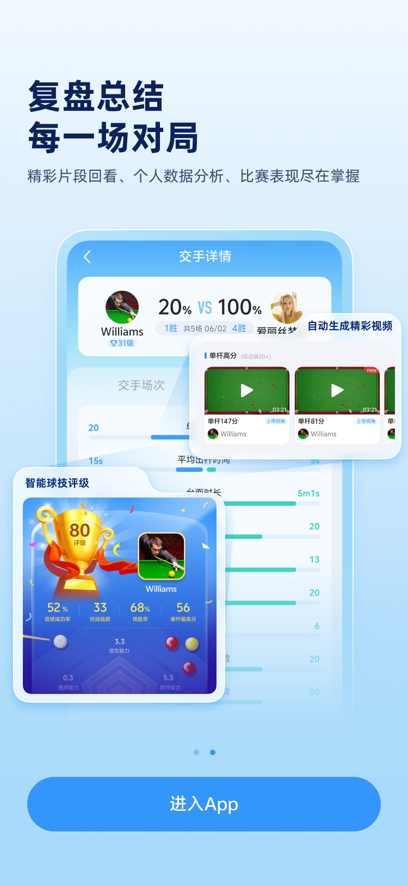
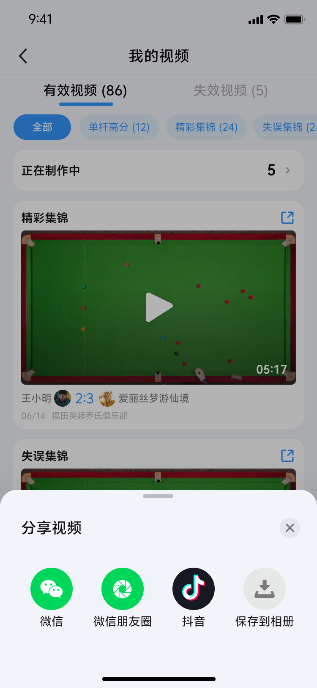
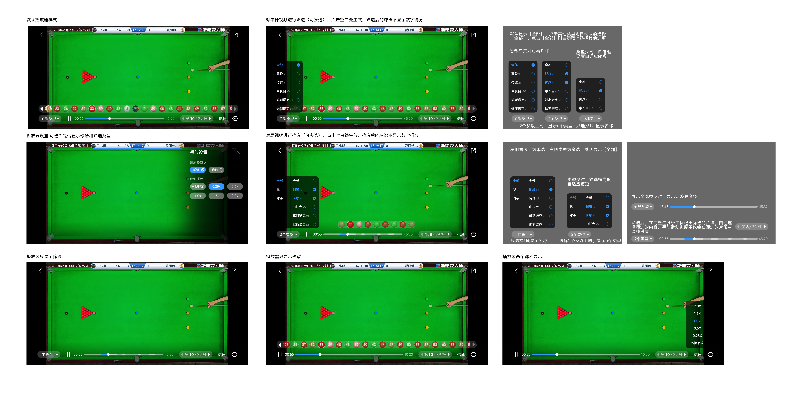

## 模块4：专业视频播放器（重点模块）

专业视频播放器是App的核心功能模块，提供球谱进度条、倍速播放、快捷操作等高级功能，是区别于竞品的核心竞争力。

### 4.1 播放器类型

#### 4.1.1 简单播放器

**使用场景**: 下载完成后、制作完成前的预览

**功能特点**:
- 基本播放控制（播放/暂停）
- 时间进度条
- 横屏播放
- 不支持球谱进度条
- 不支持倍速播放
- 不支持快捷操作

**进入方式**:
- 在我的视频-制作中列表页
- 点击已下载完成但未制作完成的视频
- 点击"预览"按钮

#### 4.1.2 专业播放器

**使用场景**: 制作完成后的视频观看

**功能特点**:
- 完整播放控制
- 球谱进度条 + 时间进度条
- 倍速播放（逐帧/0.25x/0.5x/1.0x/1.5x/2.0x）
- 快捷操作（连点/长按/滑动）
- 亮度调节
- 音量调节
- 设置功能
- 分享功能（保存至相册）

**进入方式**:
- 在我的视频页点击制作完成的视频
- 在比赛记录页点击视频
- 点击播放按钮

---

### 4.2 播放器进入方式

#### 4.2.1 入口列表

| 入口位置 | 进入方式 | 说明 |
|----------|----------|------|
| 我的视频页 | 点击视频卡片 | 进入专业播放器播放 |
| 我的视频-制作中列表 | 点击预览按钮 | 进入简单播放器预览 |
| 交手记录页 | 点击视频卡片 | 进入专业播放器播放 |
| 场详情页 | 点击视频卡片 | 进入专业播放器播放 |

#### 4.2.2 播放模式

**横屏播放**:
- 所有视频均采用横屏播放模式
- 进入播放器后自动旋转为横屏
- 退出播放器后恢复竖屏

**播放控制**:
- 默认自动播放
- 播放完成后自动回到开头重新播放

---

### 4.3 引导层交互

#### 4.3.1 引导层显示规则

**显示时机**: 前2次进入播放器时显示引导层

**引导层内容**:
- 左侧引导层：显示亮度调节区域和手势
- 右侧引导层：显示音量调节区域和手势
- 中间引导层：显示连点、长按等快捷操作

**引导层UI**:

<div align="center">
  
  
</div>

> 注：引导层为覆盖在播放器上的半透明图层，显示操作说明。
> 左侧引导层：显示亮度调节区域和手势
> 右侧引导层：显示音量调节区域和手势
> 中间引导层：显示连点、长按等快捷操作

#### 4.3.2 引导层关闭方式

**关闭方式**: 单击屏幕任意位置，引导层消失

**关闭逻辑**:
- 引导层与播放器控件同时存在时
- 先单击引导层消失
- 再单击播放器控件隐藏

**注意**:
- 引导层未关闭前，控件不可操作
- 引导层显示期间，视频正常播放

#### 4.3.3 引导层次数统计

**统计规则**:
- 统计用户进入专业播放器的次数
- 前2次进入时显示引导层
- 第3次及以后不再显示

**次数重置**:
- 次数与用户账号绑定
- 不因卸载重装而重置
- 不因清除缓存而重置

---

### 4.4 快捷操作

专业播放器支持多种快捷操作手势，提升用户操作效率。

#### 4.4.1 连点操作

**触发区域**: 屏幕热点区域

<div align="center">
  
</div>

**热点区域划分**:
- **左半屏**: 快退至上一杆
- **右半屏**: 快进至下一杆
- **中心区域**: 暂停/播放

**连点规则**:
- 连点间隔时间：0~1s（大于1s不触发连点）
- 连点次数：2次及以上
- 触发效果：快进/快退至下一杆/上一杆

**边界处理**:
- 快退时已是第一杆：顶部Toast提示"已是第一杆"
- 快进时已是最后一杆：顶部Toast提示"已是最后一杆"

**视觉反馈**:
- 连点后，屏幕显示遮罩
- 遮罩显示1s后消失
- 遮罩内容：显示快进/快退图标

**连点操作UI**:

<div align="center">
  
</div>

> 注：连点后屏幕显示遮罩，显示1s后消失。
> 遮罩内容：显示快进/快退图标

#### 4.4.2 长按操作

**触发条件**: 长按屏幕热点区域1.5s

**触发区域**: 屏幕任意位置（除控件区域外）

**功能**: 2.0倍速快进

**视觉反馈**:
- 屏幕顶部显示"2.0x快进中"
- 视频以2.0倍速播放

**取消方式**: 松开手指即取消快进，提示消失

**长按操作UI**:

<div align="center">
  
</div>

> 注：长按屏幕1.5s后，以2.0倍速快进，屏幕顶部显示"2.0x快进中"

#### 4.4.3 滑动操作

**亮度调节**:
- 触发区域：屏幕左边热点区域
- 操作方式：上下滑动
- 视觉反馈：显示亮度条，无调整2s后消失

**音量调节**:
- 触发区域：屏幕右边热点区域
- 操作方式：上下滑动
- 视觉反馈：显示音量条，无调整2s后消失

**滑动操作UI**:

> 注：亮度调节和音量调节为覆盖在播放器上的指示条。
> 
> 亮度调节：
> - 触发区域：屏幕左边热点区域
> - 操作方式：上下滑动
> - 视觉反馈：显示亮度条，无调整2s后消失
> 
> 音量调节：
> - 触发区域：屏幕右边热点区域
> - 操作方式：上下滑动
> - 视觉反馈：显示音量条，无调整2s后消失
> 
> 实际UI展示请参考完整播放器界面截图。

---

### 4.5 播放器设置

#### 4.5.1 设置入口

**入口位置**: 播放器控制栏中的设置图标

**打开方式**: 点击设置图标，从屏幕右侧弹出设置弹窗

**设置弹窗UI**:

<div align="center">
  
</div>

> 设置弹窗从屏幕右侧弹出，包含进度条设置、倍速设置等选项。

#### 4.5.2 进度条设置

**设置项**: 球谱开关

**开关状态**:
- **开启（默认）**: 球谱与时间进度条绑定同步显示
- **关闭**: 仅显示时间进度条

**记忆功能**:
- 记住用户上次在任一视频选择的播放器形式
- 下次进入视频时，使用上次的设置

**设置UI**:

> 注：球谱开关为设置项，开启后显示球谱进度条，关闭后仅显示时间进度条。
> 
> - 开启状态：球谱与时间进度条绑定同步显示
> - 关闭状态：仅显示时间进度条

<div align="center">
  
</div>

---

### 4.6 进度条详解

#### 4.6.1 球谱进度条

**球谱进度条**是专业播放器的核心特色功能，以球谱形式展示视频进度。

**显示内容**:

**局视频**:
- 标记甲乙双方
- 标记犯规
- 标记进球
- 标记自由球
- 不标注：手动改分、换人、撤回操作

**单杆视频**:
- 按单杆球谱顺序排列
- 显示每一杆的击球信息

**球谱进度条UI**:

<div align="center">
  
</div>

> 注：球谱进度条显示在播放器底部，以球谱形式展示视频进度。

#### 4.6.2 球谱进度条交互

**焦点跟随**:
- 播放到哪个球，焦点移到哪个球
- 自动选中的焦点球始终保持在球谱中心位置

**自动居中**:
- 当前播放的焦点球被手动滑动到非中心位置时
- 5s无操作，焦点球自动回到中间位置
- 自动回滚以后，重置自动隐藏的时间

**单击跳转**:
- 单击球谱中的球，跳转到对应位置播放

**按住预览**:
- 按住球2s，显示画面预览
- 预览画面显示在该球对应位置

**超一屏处理**:
- 球谱长度超过一屏时，两端显示左右键
- 支持滑动查看

**球谱进度条交互UI**:

<div align="center">
  
</div>

> 注：按住球2s，显示画面预览。预览画面显示在该球对应位置。

#### 4.6.3 时间进度条

**显示规则**:
- 球谱开关开启：球谱与时间进度条绑定同步显示
- 球谱开关关闭：仅显示时间进度条

**交互方式**:
- 按住拖动：一直显示预览画面
- 松开手指：关闭预览，跳转到相应定位

**跟随控件**:
- 时间进度条跟随控件显示/隐藏
- 点击屏幕出现，6s无操作消失

**时间进度条UI**:

<div align="center">
  
</div>

#### 4.6.4 球谱元素说明

**球的颜色标识**:

> 注：以下为球谱中的球颜色标识（小图标），实际UI展示请参考完整播放器界面截图。
> 
> | 球类型 | 颜色 | 分值 |
> |--------|------|------|
> | 黄球 | 黄色 | 1分 |
> | 绿球 | 绿色 | 2分 |
> | 咖啡球 | 棕色 | 3分 |
> | 蓝球 | 蓝色 | 4分 |
> | 粉球 | 粉色 | 5分 |
> | 黑球 | 黑色 | 6分 |

**犯规标识**:

> 注：犯规标识为小图标，显示在球谱中对应位置。
> 
> 犯规标识：红色"犯规"字样

**罚分标识**:

> 注：罚分标识为小图标，显示在球谱中对应位置。
> 
> 罚分标识：显示罚分数值

---

### 4.7 倍速播放

#### 4.7.1 倍速选项

| 倍速 | 说明 | 音频处理 |
|------|------|----------|
| 逐帧 | 逐帧播放 | 静音 |
| 0.25x | 0.25倍速 | 静音 |
| 0.5x | 0.5倍速 | 正常 |
| 1.0x | 默认速度 | 正常 |
| 1.5x | 1.5倍速 | 正常 |
| 2.0x | 2.0倍速 | 正常 |

#### 4.7.2 倍速设置规则

**默认倍速**: 1.0x

**重置规则**: 每次进入视频播放器，倍速重置为1.0x

**生效方式**: 选择后立即生效

**特殊处理**:
- 逐帧播放时，音频静音
- 0.25x播放时，音频静音

#### 4.7.3 倍速切换方式

**入口**: 播放器控制栏中的倍速按钮

**操作**:
1. 点击倍速按钮
2. 弹出倍速选择列表
3. 选择目标倍速
4. 立即生效

**倍速切换UI**:

<div align="center">
  
</div>

---

### 4.8 分享功能（第一期）

#### 4.8.1 分享入口

**入口1**: 专业播放器内的分享按钮

**入口2**: 我的视频页视频卡片右上角

#### 4.8.2 分享途径（第一期）

**第一期仅支持**: 保存至相册

**第二期计划支持**:
- 分享到微信好友
- 分享到朋友圈
- 分享到抖音

#### 4.8.3 保存至相册流程

```
1. 用户点击分享按钮
   ↓
2. 弹出分享弹窗
   ↓
3. 用户点击"保存至相册"
   ↓
4. 判断用户相册权限状态
   ↓
   ├─ 已授权 → 保存到相册 → 提示"已保存至相册"
   │
   ├─ 未授权 → 请求权限
   │          ├─ 用户同意 → 保存到相册 → 提示"已保存至相册"
   │          └─ 用户拒绝 → 提示"无相册权限，请至设置中开启"
   │
   └─ 已拒绝 → 提示"无相册权限，请至设置中开启"
```

#### 4.8.4 分享弹窗UI

<div align="center">
  
</div>

---

### 4.9 播放器控件显示规则

#### 4.9.1 控件显示/隐藏

**显示方式**:
- 单击屏幕空白处：显示完整控件栏
- 控件栏包括：进度条、倍速按钮、设置按钮、分享按钮、返回按钮

**隐藏方式**:
- 单击屏幕空白处：隐藏控件栏
- 6s左右不操作：控件自动消失

**控件UI**:

<div align="center">
  
</div>

#### 4.9.2 控件元素

**进度条**:
- 球谱进度条 + 时间进度条（球谱开关开启时）
- 仅时间进度条（球谱开关关闭时）

**倍速按钮**:
- 显示当前倍速（如"1.0x"）
- 点击弹出倍速选择列表

**设置按钮**:
- 点击弹出设置弹窗

**分享按钮**:
- 点击弹出分享弹窗

**返回按钮**:
- 点击退出播放器，返回上一页

#### 4.9.3 控件交互

**控件显示时**:
- 可操作控件
- 视频正常播放

**控件隐藏时**:
- 全屏显示视频画面
- 支持快捷操作（连点/长按/滑动）

---

### 4.10 播放完成行为

#### 4.10.1 循环播放

**行为**: 视频播放完后，自动回到开头重新播放

**逻辑**:
- 视频播放到最后一帧
- 自动跳转到第一帧
- 继续播放

**注意**:
- 循环播放不会触发埋点
- 仅首次播放触发video_play埋点

---

### 4.11 特殊倍速处理

#### 4.11.1 静音规则

**逐帧播放**: 音频静音

**0.25x播放**: 音频静音

**原因**:
- 逐帧播放和0.25x倍速过低
- 音频会产生严重失真
- 为提升用户体验，自动静音

#### 4.11.2 正常倍速

**0.5x、1.0x、1.5x、2.0x**: 音频正常播放

**处理**:
- 音频随视频倍速变化
- 保持音画同步

---

### 4.12 播放器方案交互说明

<div align="center">
  
</div>

**交互说明**:
1. **单击屏幕**: 显示/隐藏控件栏
2. **连点左半屏**: 快退至上一杆
3. **连点右半屏**: 快进至下一杆
4. **连点中心**: 暂停/播放
5. **长按屏幕**: 2.0倍速快进
6. **左半屏上下滑动**: 调节亮度
7. **右半屏上下滑动**: 调节音量
8. **拖动进度条**: 跳转到对应位置

---

*下一章: [模块5：交手记录模块](#模块5交手记录模块)*
