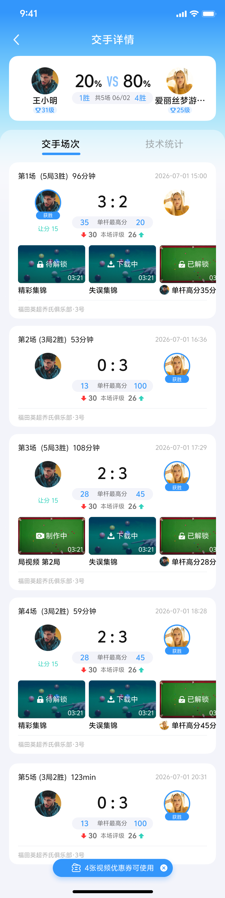
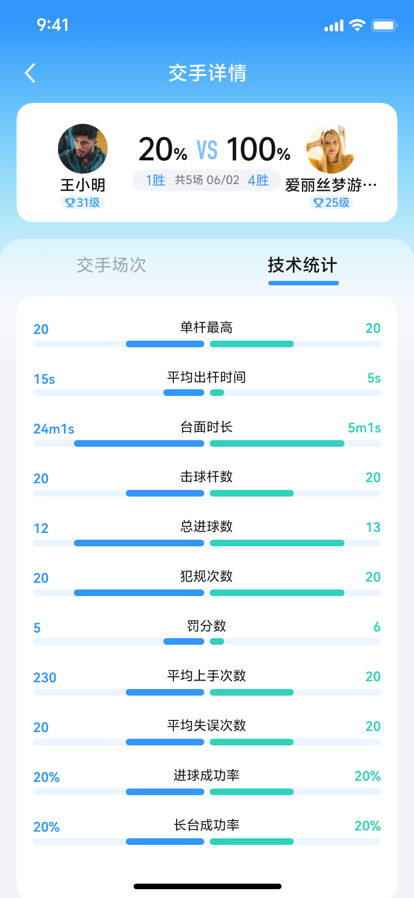

## 模块5：交手记录模块

交手记录模块是用户查看历史比赛和对手数据的核心页面，本期新增横滑视频卡片功能，提升用户对可解锁视频的感知。

### 5.1 交手卡片优化

#### 5.1.1 页面交互修改

**上划交互**:
- 交手记录 & 我的数据 Tab & 时间筛选器
- 滑动到顶部时固定
- 仅下方页面上划

**页面布局**:

```
┌─────────────────────────────┐
│  顶部标题栏（固定）           │
├─────────────────────────────┤
│  Tab栏：交手记录 | 我的数据   │
├─────────────────────────────┤
│  时间筛选器（固定）           │
│  本周 | 本月 | 近三月 | 自定义 │
├─────────────────────────────┤
│                             │
│  交手卡片列表（可滚动）       │
│                             │
│  ┌───────────────────────┐  │
│  │ 交手卡片1              │  │
│  │ [对手头像] [对手昵称]  │  │
│  │ [交手记录] [视频卡片]  │  │
│  └───────────────────────┘  │
│                             │
│  ┌───────────────────────┐  │
│  │ 交手卡片2              │  │
│  │ ...                    │  │
│  └───────────────────────┘  │
│                             │
└─────────────────────────────┘
```

#### 5.1.2 交手卡片结构

**卡片元素**:
- 对手头像
- 对手昵称
- 交手记录（X局X胜）
- 本场评级（⬆️⬇️标识）
- 横滑视频卡片（新增）

**交手卡片UI**:

<div align="center">
  
</div>

---

### 5.2 视频卡片展示

#### 5.2.1 展示规则

**新增位置**: 交手卡片、场卡片下方

**展示内容**: 用户与该对手最近一场比赛的视频回放，以横滑卡片形式展示

**展示的视频状态类型**:
- 待解锁
- 下载中
- 制作中
- 已解锁

**不展示的视频状态**:
- 下载失败
- 制作失败
- 已过期

**特殊处理**: 如视频均过期，则不显示视频卡片

#### 5.2.2 视频卡片刷新时机

**刷新时机**:
- 切换页面时刷新
- 切换Tab时刷新

**刷新逻辑**:
- 重新查询视频列表
- 更新视频卡片状态
- 保持视频排序规则

#### 5.2.3 视频展示顺序

**优先级排序**:

**第一优先级**: 待解锁视频 > 已解锁视频

**第二优先级**: 视频类型顺序
1. 我的单杆高分
2. 对手的单杆高分
3. 精彩集锦
4. 失误集锦
5. 局视频

**同类型排序规则**:
- **单杆高分**: 按分数顺序排列，相同分数的按时间倒序排列
- **局视频**: 按局序号顺序排列

**排序示例**:
```
视频列表（共10个）：
1. 我的单杆高分100分（待解锁）
2. 我的单杆高分80分（已解锁）
3. 对手的单杆高分90分（待解锁）
4. 精彩集锦（已解锁）
5. 失误集锦（待解锁）
6. 局视频第1局（已解锁）
7. 局视频第2局（已解锁）
...
```

#### 5.2.4 视频卡片交互

**横滑交互**:
- 视频列表支持左右横滑
- 最大展示数量：8个
- 超出8个显示【查看更多】

**点击交互**:
- 在交手卡片下点击视频卡片：进入最新一场比赛的视频列表页
- 在交手卡片下点击【查看更多】：进入最新一场比赛的视频列表页
- 在场卡片下点击视频卡片：进入该场比赛的视频列表页
- 在场卡片下点击【查看更多】：进入该场比赛的视频列表页

**视频卡片UI**:

<div align="center">
  
</div>

---

### 5.3 场卡片优化

#### 5.3.1 本场评级外显

**评级标识**:
- ⬆️ 标识：发挥超常
- ⬇️ 标识：发挥失常

**显示位置**: 场卡片顶部

**评级计算**:
- 基于用户在该场比赛的表现
- 与历史平均数据对比
- 超常：表现明显优于平均水平
- 失常：表现明显低于平均水平

**场卡片UI**:

<div align="center">
  
</div>

#### 5.3.2 头像处标记评级

**标记位置**: 顶部交手卡片头像处

**标记内容**: 评级标识（⬆️/⬇️）

**标记规则**:
- 仅在该场比赛有评级时显示
- 评级标识显示在头像右上角

#### 5.3.3 格式修改

**原格式**: "共X局"

**新格式**: "X局X胜"

**示例**:
- 原：共5局
- 新：5局3胜

**英文文案**: 
- X matches X wins

---

### 5.4 交手详情页

#### 5.4.1 页面结构

**页面入口**:
- 点击交手卡片
- 点击交手记录中的某个对手

**页面布局**:

```
┌─────────────────────────────┐
│  返回按钮  交手详情  分享按钮 │
├─────────────────────────────┤
│                             │
│  交手卡片                    │
│  [对手头像+评级] [对手昵称]  │
│  [交手记录] [X局X胜]        │
│                             │
├─────────────────────────────┤
│                             │
│  场卡片列表（可滚动）         │
│                             │
│  ┌───────────────────────┐  │
│  │ 场卡片1               │  │
│  │ [比赛时间] [评级⬆️/⬇️] │  │
│  │ [比分] [视频卡片]     │  │
│  └───────────────────────┘  │
│                             │
│  ┌───────────────────────┐  │
│  │ 场卡片2               │  │
│  │ ...                   │  │
│  └───────────────────────┘  │
│                             │
└─────────────────────────────┘
```

#### 5.4.2 场卡片内容

**卡片元素**:
- 比赛时间
- 本场评级（⬆️/⬇️）
- 比分（我方 vs 对方）
- 局数（X局X胜）
- 横滑视频卡片

**视频卡片**:
- 展示该场比赛的视频
- 横滑展示，最多8个
- 超出显示【查看更多】

**场卡片UI**:

<div align="center">
  
</div>

---

### 5.5 视频列表页

#### 5.5.1 页面入口

- 在交手卡片下点击视频卡片或【查看更多】
- 在场卡片下点击视频卡片或【查看更多】

#### 5.5.2 页面内容

**页面布局**:

```
┌─────────────────────────────┐
│  返回按钮  视频列表  分享按钮 │
├─────────────────────────────┤
│                             │
│  比赛信息                    │
│  [对手头像] [对手昵称]       │
│  [比赛时间] [比分]           │
│                             │
├─────────────────────────────┤
│                             │
│  视频列表（可滚动）           │
│                             │
│  [视频卡片1]                │
│  [视频卡片2]                │
│  [视频卡片3]                │
│  ...                        │
│                             │
└─────────────────────────────┘
```

**视频卡片**:
- 显示该场比赛的所有视频
- 按类型和分数排序
- 显示视频状态

#### 5.5.3 视频卡片操作

**点击视频卡片**:
- 待解锁视频：弹出解锁弹窗
- 下载中/制作中视频：显示进度
- 已解锁视频：进入专业播放器播放

**视频卡片UI**:

> 注：视频卡片显示在交手卡片和场卡片下方，以横滑形式展示。
> 
> 视频卡片内容：
> - 视频封面
> - 视频状态（待解锁/下载中/制作中/已解锁）
> - NEW标记（未播放视频）
> 
> 实际UI展示请参考完整界面截图。

<div align="center">
  
</div>

---

### 5.6 空状态处理

#### 5.6.1 交手记录空状态

**触发条件**: 用户无任何比赛记录

**展示内容**:
- 空状态插画
- 文案："暂无交手记录"

**空状态UI**:

<div align="center">
  
</div>

#### 5.6.2 视频卡片空状态

**触发条件**: 该场比赛无视频，或所有视频均已过期

**处理方式**: 不显示视频卡片区域

---

*下一章: [模块6和模块7](#模块6多语言支持与模块7埋点规范)*
