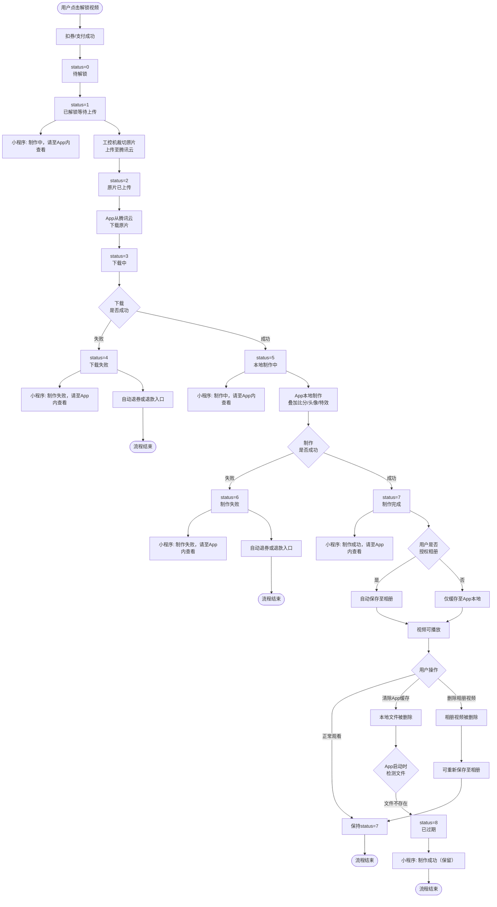
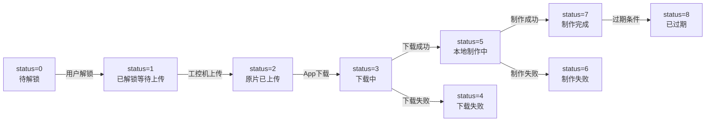

# 视频状态流转流程图（修复版）

## 状态码定义

| 状态码 | App显示状态 | 小程序显示文案 |
|:---:|:---:|:---:|
| 0 | 待解锁 | 待解锁 |
| 1 | 已解锁等待上传 | 制作中，请至App内查看 |
| 2 | 原片已上传 | 制作中，请至App内查看 |
| 3 | 下载中 | 制作中，请至App内查看 |
| 4 | 下载失败 | 制作失败，请至App内查看 |
| 5 | 本地制作中 | 制作中，请至App内查看 |
| 6 | 制作失败 | 制作失败，请至App内查看 |
| 7 | 制作完成 | 制作成功，请至App内查看 |
| 8 | 已过期 | 已过期 |

---

## 主流程图



---

## 关键分支说明

### 分支A：解锁成功后相册权限

| 场景 | 结果 | 文件存储 |
|------|------|---------|
| **允许相册权限** | 制作完成后自动保存至相册 | App本地缓存 + 系统相册 |
| **不允许相册权限** | 仅缓存至App本地 | 仅App本地缓存 |

### 分支B：制作成功后文件删除

| 用户操作 | App状态 | 小程序状态 | 能否恢复 |
|---------|---------|----------|---------|
| **清除App缓存** | status=8 已过期 | 仍显示"制作成功" | ❌ 不可恢复 |
| **删除相册视频** | status=7 制作完成 | 仍显示"制作成功" | ✅ 可重新保存 |
| **卸载重装App** | status=8 已过期 | 仍显示"制作成功" | ❌ 不可恢复 |

---

## 简化版流程图（仅核心路径）



---

## 小程序状态同步对照表

| App状态码 | App显示 | 小程序显示 | 同步时机 |
|:---:|:---:|:---:|:---|
| 0 | 待解锁 | 待解锁 | 工控机生成视频列表后 |
| 1 | 已解锁等待上传 | 制作中，请至App内查看 | 解锁成功后立即同步 |
| 2 | 原片已上传 | 制作中，请至App内查看 | 工控机上传完成后 |
| 3 | 下载中 | 制作中，请至App内查看 | App开始下载后 |
| 4 | 下载失败 | 制作失败，请至App内查看 | 下载失败时 |
| 5 | 本地制作中 | 制作中，请至App内查看 | App开始制作后 |
| 6 | 制作失败 | 制作失败，请至App内查看 | 制作失败时 |
| 7 | 制作完成 | 制作成功，请至App内查看 | 制作完成时 |
| 8 | 已过期 | 已过期（注：缓存清除时小程序仍显示"制作成功"） | 过期条件触发时 |

---

## 测试用例覆盖

### 相册权限分支

| 用例编号 | 场景 | 预期结果 |
|---------|------|---------|
| TC-012 | 解锁后弹窗询问相册权限 | 授权后制作完成自动保存相册 |
| TC-021 | 制作完成未授权仅缓存 | 拒绝授权后仅缓存至App本地 |

### 文件删除分支（新增）

| 用例编号 | 场景 | App状态 | 小程序状态 | 优先级 |
|---------|------|---------|----------|:---:|
| TC-034 | 缓存被清除显示已过期 | status=8 | 制作成功 | P1 |
| **TC-118** | **制作成功后删除相册视频** | **status=7** | **制作成功** | **P1** |
| **TC-119** | **制作成功后清除App缓存** | **status=8** | **制作成功** | **P0** |
| **TC-120** | **卸载重装App后视频状态** | **status=8** | **制作成功** | **P1** |

### 冒烟测试补充（新增）

| 用例编号 | 场景 | 覆盖分支 |
|---------|------|---------|
| **SM-009** | **相册权限授权+制作完成保存相册** | 分支A-允许 |
| **SM-010** | **相册权限拒绝+制作完成仅缓存** | 分支A-拒绝 |
| **SM-011** | **制作成功后清除App缓存验证过期** | 分支B-缓存清除 |

---

## 特殊说明：缓存清除时小程序状态

**PRD原文**（Page 10）：
> 9. 已过期
>    a. 以下3种情况，视频均显示为【已过期】状态
>       iii. 视频在App本地缓存被清除（新增）
>       **1. 小程序显示【制作成功】**
>    b. 视频状态同步至小程序，显示【已过期】（现有样式）

**解读**：
- 48小时未解锁、90天未制作 → 小程序同步为"已过期"
- **缓存被清除** → 小程序**仍显示"制作成功"**（不是"已过期"）

**可能原因**：营销考虑，让用户感觉视频仍然"可用"，引导用户重新下载App或联系客服获取帮助。

**技术实现**：
```
缓存清除场景：
- App检测到本地文件不存在 → status=8（已过期）
- 但服务器不主动更新小程序状态 → 小程序保持"制作成功"
- 或App不上报缓存清除事件给服务器 → 服务器无法同步
```

---

*文档更新日期：2026-07-29*
